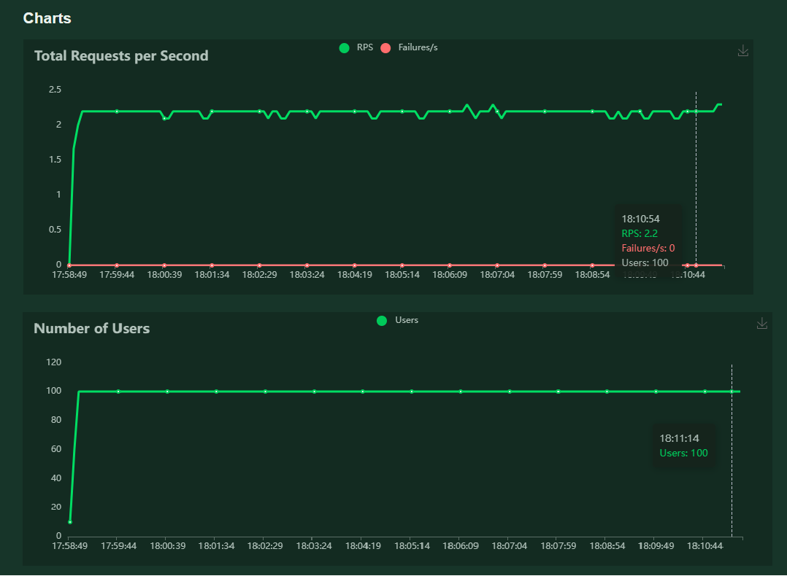

## License
This project is licensed under the MIT License - see the [LICENSE](LICENSE) file for details.

# Sistema de QC precipitaciones con DeepLearning  (Version 1.0.0)
En Perú, el SENAMHI recolectó 3.5 millones de datos de precipitación entre 2020 y 2021 mediante estaciones meteorológicas automáticas. Del total, el sistema automatizado de control de calidad (QC) identificó el 4% de los datos como sospechosos por valores extremos, pero solo el 53% de estos fue validado manualmente a tiempo.

Para mejorar este proceso, se propone un modelo de aprendizaje profundo basado en imágenes satelitales y datos auxiliares para validar datos extremos en tiempo real. El modelo utiliza una arquitectura CNN-RNN entrenada con etiquetas del proceso manual de QC. 

# Servicio web

> El proyecto tiene un proceso asíncrono que se ejecuta cada 10 minutos. Este proceso descarga (en caso no se tenga aún) las imagenes satelitales de la última hora. 

Los parametros de configuracion del servicio web como el uso de espacio, validacion, umbral para definir el flag de conforme y malo están en utils/config.py.

## 1. Esctructura del proyecto  
**La estructura base será:**  

base_dir/  
├───📁 utils/  
│   └───📄 config.py  
│   └───📄 goes.py  
│   └───📄 logs.py  
│   └───📄 model.py  
│   └───📄 predict.py  
    ...  
├───📄 main.py  
├───📄 req.txt  
├───📄 app_logs.log 
├───📄 test.py  
├───📁 imagenes/  
├───📁 models/  
├───📁 static/  
├───📁 templates/  
       ....  

## 2. Instalacion
El servicio web esta desarrollado en Flask 3.1.0 en la version de Python 3.10.1. 
Las librerias utilizadas estan en el archivo req.txt. Para su instalacion se puede seguir los siguientes pasos.

- 1. Instalar python > 3.10.1
- 2. Instalar las librerias utilizando CMD con el comando 
    > pip install -r req.txt
- 3. Inicar el servicio utilizando CMD con el comando
    > python main.py

## 3. Uso
El uso del API principal sera BASE_URL/predict/< fecha >/< dato >/< longitud >/< latitud >/< altitud >/< umbral >

> e.g BASE_URL/predict/2024-11-27-15-00/10/-80/-20/1000/8

## 4. Responses
El API **/predict** retomara un diccionario (json) con los siguientes campos (respetando minúsculas):

- **Flag** : Indica si es malo (M), conforme (C) o NC (no corresponde/Error).
- **Message**: Mensaje de advertencia o error.
- **Probability** : Probabilidad de ser conforme el dato de precipitación (de 0 a 1).
- **Status** : True, si el proceso se ejecutó correctamente, caso contrario será False.
- **color** : Color subjetivo que indica el Flag (C=Verde ,M=Rojo, NC=Naranja)
- **parametros** : Parametros que utilizó el modelo para su prediccion. 
    - **Dato** : Valor de precipitación en mm/h
    - **Fecha** : Fecha en que se tomó el valor de precipitacion 
    - **Latitud** : Latitud de la estacion
    - **Longitud** : Longitud de la estacion
    - **Altitud** : Altitud de la estacion
    - **per90** : percentil 90 de los datos de precipitación en la estación

## 5. Logging
Los logging se realizaran con logging de python. Se guardará en un archivo app_logs.log, además se imprimiran en la consola. **Los logging se colocarán despues de la logica que hace referencia**
El formato basico de los archivos de log tendrá 
> FECHA - NIVEL_DEGUB - Mensaje
 

Existen 5 niveles de Logging **info,debug,warning,error,critical**. Todas las vistas tendrán minimo estos logging:
- Al inicio de la petición (request) el middleware hará logging (info) del nombre de la consulta con un ID asignado. 
- Al final de la petición el middleware hará logging (info) con la metada generada de la petición.
- En caso de excepciones no mapeadas en el request, el middleware capturará la expceción y generará un logging (critical), para así evitar que el backend deje de funcionar.

## 6. Pruebas
Se han desarrolado las pruebas unitarias y las pruebas de estrés con exito. Se adjunta el archivo de pruebas en el github.

Se ha desplegado de manera global para realizar las pruebas pertinentes. 
El acceso es a través del del IP 34.68.174.131:5000. Las rutas disponibles son:
    -	http://34.68.174.131:5000/  : Acceso a la interfaz de pruebas
    -	http://34.68.174.131:5000/predict/2024-11-27-16-00/0.2/-80/-20/100/1 : Uso de endpoint
    -	http://34.68.174.131:5000/view-logs : Visualizar Logs
    -	http://34.68.174.131:5000/check_images : Visualizar imágenes disponibles

